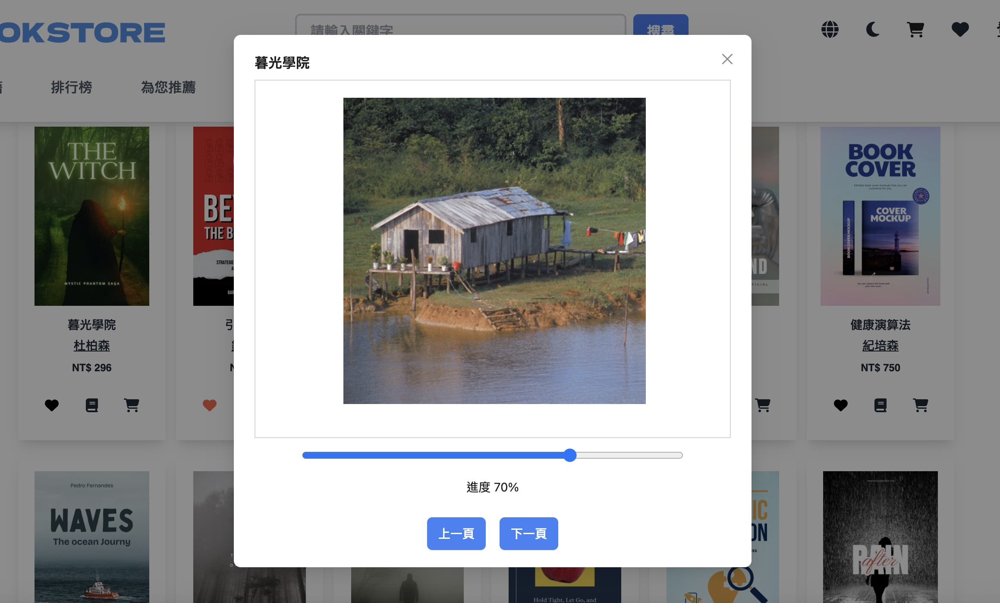

# Bookstore 




---

## 🚀 Project Overview

**Bookstore** was born from my recent fascination with e‑books. I set out to build a platform that **seamlessly integrates selecting, purchasing, and reading** into a single flow—both to scratch my own itch and to sharpen my front‑end skills.

---

## 📺 Demo

[bookstore‑gilt‑phi.vercel.app](https://bookstore-gilt-phi.vercel.app/)

---

## 🧑‍💻 Demo Test Account

For reviewer/testing login, use the following test credentials:

- **Email:** `lufy5656@test.com`
- **Password:** `d565656`

---

* Unified browsing, shopping cart, and reader experience.
* Fast e‑book rendering with **ePub.js**.
* Lightweight internationalisation (i18next) with English / Chinese.
* Light / Dark theme toggle.

---

## 🎯 Core Features

1. **E‑book Shopping & Reading**

   * Page turning and progress bar powered by ePub.js.
   * Complete shopping‑cart checkout flow.

2. **User Authentication**

   * JWT‑based login with Supabase Auth.

3. **Internationalisation**

   * Real‑time language switch (EN / ZH).

4. **UI / UX**

   * Light & Dark theme support.

5. **Search**

   * In‑site book search.

---

## 🛠 Tech Stack

### Front‑end

* **Frameworks:** React, React Router, Zustand
* **Styling:** Ant Design, Tailwind CSS
* **Bundler:** Vite

### Backend/BaaS

* Supabase

### Additional Tools

* **Reader:** ePub.js
* **HTTP:** Axios
* **i18n:** i18next

---

## 🔧 Setup

```bash
# 1. Clone the repo
git clone https://github.com/Wuzi51/bookstore.git
cd bookstore

# 2. Install dependencies
npm install

# 3. Environment variables (Supabase)
cp .env.example .env   # add VITE_SUPABASE_URL & VITE_SUPABASE_ANON_KEY

# 4. Start dev server
npm run dev   # default: http://localhost:3000
```

---

## 📌 Roadmap

* Add more language options.
* Enhance cart & checkout (payment mock).
* Member centre and admin dashboard.
* Stronger form validation.

---
